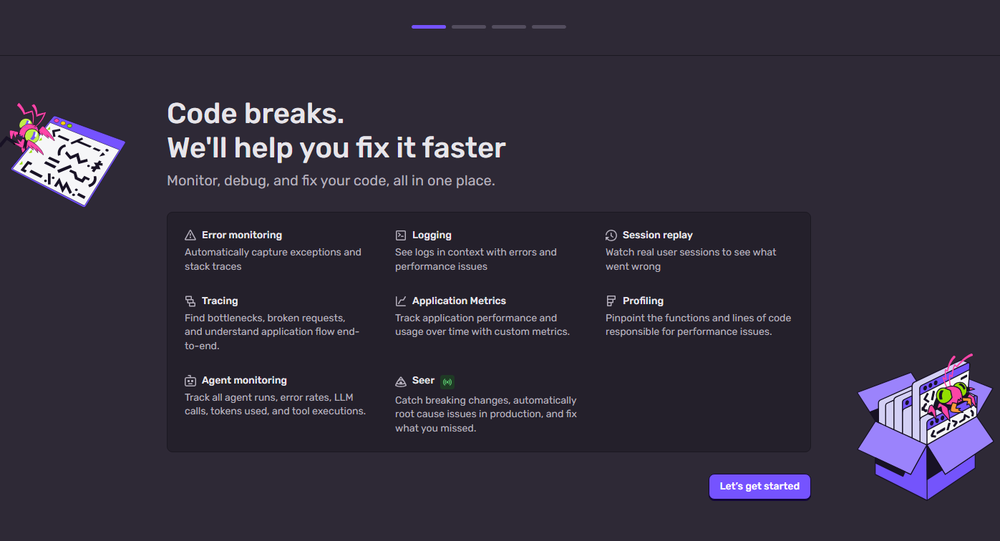
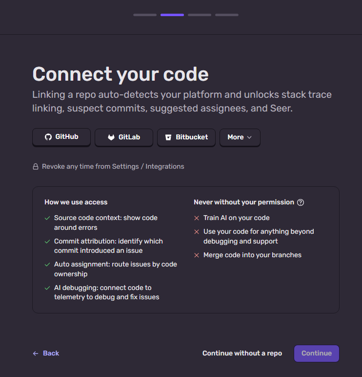
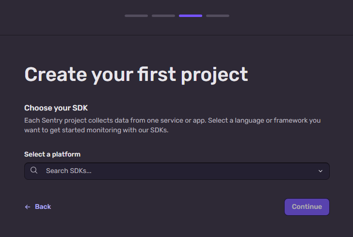
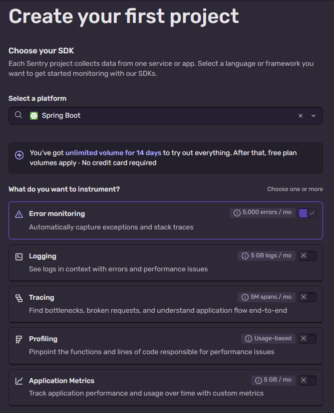
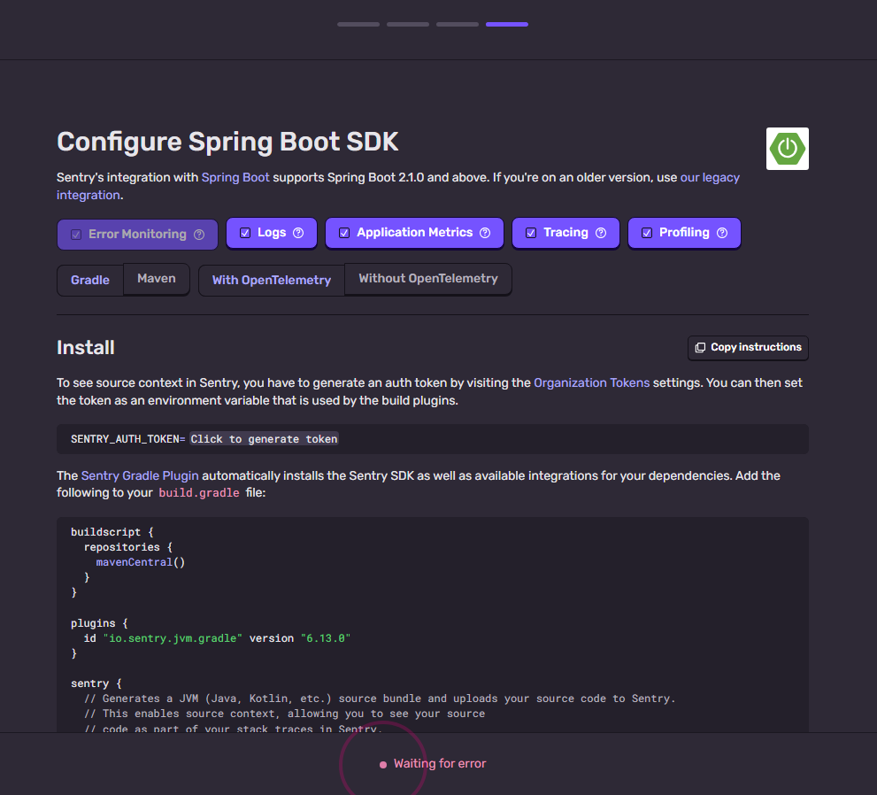

# Sentry Onboarding after account creation

Onboarding for example course organization: DevPowers

## Step 1 - Features



Code breaks.
We'll help you fix it faster
Monitor, debug, and fix your code, all in one place.
Error monitoring
Automatically capture exceptions and stack traces

Logging
See logs in context with errors and performance issues

Session replay
Watch real user sessions to see what went wrong

Tracing
Find bottlenecks, broken requests, and understand application flow end-to-end.

Application Metrics
Track application performance and usage over time with custom metrics.

Profiling
Pinpoint the functions and lines of code responsible for performance issues.

Agent monitoring
Track all agent runs, error rates, LLM calls, tokens used, and tool executions.

Seer
Catch breaking changes, automatically root cause issues in production, and fix what you missed.

---

## Step 2 - Connect your code



Linking a repo auto-detects your platform and unlocks stack trace linking, suspect commits, suggested assignees, and Seer.

- GitHub
- GitLab
- Bitbucket
- More (Perforce, Azure DevOps)

Revoke any time from Settings / Integrations

### How we use access
- Source code context: show code around errors
- Commit attribution: identify which commit introduced an issue
- Auto assignment: route issues by code ownership
- AI debugging: connect code to telemetry to debug and fix issues

### Never without your permission
- Train AI on your code
- Use your code for anything beyond debugging and support
- Merge code into your branches

---

## Step 3 - Choose SDK for a first Project



Create your first project
Choose your SDK
Each Sentry project collects data from one service or app. Select a language or framework you want to get started monitoring with our SDKs.
Select a platform
Search SDKs...

> SDKs list mix SDKs with guides, e.g. there is only one `sentry-cocoa` SDK for Apple but it covers iOS, macOS, tvOS, watchOS, iPadOS and visionOS.
> On the Sentry Onboarding select filed you will see 3 options: Apple, iOS, macOS
> They lead to separate guides but uses same SDK underhood: https://github.com/getsentry/sentry-cocoa
> Same with Spring, Spring Boot, Logback and Log4j - all framework guides (available in select) based on same Java SDK: https://github.com/getsentry/sentry-java

> For Android native apps use **Sentry Android SDK**, it supports both Java and Kotlin. The Kotlin SDK is for Kotlin Multiplatform (KMP - apps for Android, iOS and Desktop).

> Situation is a little different for **JavaScript**, where we have one main JS SDK: https://github.com/getsentry/sentry-javascript
> But this one repo delivers multiple separate NPM packages, specific for every use case and framework, e.g.: Browser, Node.js, Angualar, React, Next.js, Astro, Bun, etc.
> They share parts of code from `core`, `browser-utils`, `types` and `node` packages + add framework specific features.

## Step 3b - Features / Instrumentation



What do you want to instrument?
Choose one or more

Error monitoring
5,000 errors / mo
Automatically capture exceptions and stack traces

Logging
5 GB logs / mo
See logs in context with errors and performance issues

Tracing
5M spans / mo
Find bottlenecks, broken requests, and understand application flow end-to-end

Profiling
Usage-based
Pinpoint the functions and lines of code responsible for performance issues

Application Metrics
5 GB / mo
Track application performance and usage over time with custom metrics

---

## Step 4a - Spring Boot Configs



Configure Spring Boot SDK

Sentry's integration with Spring Boot supports Spring Boot 2.1.0 and above. If you're on an older version, use our legacy integration.

### Install

To see source context in Sentry, you have to generate an auth token by visiting the [Organization Tokens](/settings/devpowers/auth-tokens/) settings. You can then set the token as an environment variable that is used by the build plugins.

```bash
SENTRY_AUTH_TOKEN=___ORG_AUTH_TOKEN___
```

The [Sentry Gradle Plugin](https://github.com/getsentry/sentry-android-gradle-plugin) automatically installs the Sentry SDK as well as available integrations for your dependencies. Add the following to your `build.gradle` file:

```groovy

buildscript {
  repositories {
    mavenCentral()
  }
}

plugins {
  id "io.sentry.jvm.gradle" version "6.13.0"
}

sentry {
  // Generates a JVM (Java, Kotlin, etc.) source bundle and uploads your source code to Sentry.
  // This enables source context, allowing you to see your source
  // code as part of your stack traces in Sentry.
  includeSourceContext = true

  org = "devpowers"
  projectName = "java-spring-boot"
  authToken = System.getenv("SENTRY_AUTH_TOKEN")
}

dependencies {
  implementation 'io.sentry:sentry-async-profiler:8.46.0'
}

```

When running your application, please add our `sentry-opentelemetry-agent` to the `java` command. You can download the latest version of the `sentry-opentelemetry-agent.jar` from [MavenCentral](https://search.maven.org/artifact/io.sentry/sentry-opentelemetry-agent). It's also available as a `ZIP` containing the `JAR` used on this page on [GitHub](https://github.com/getsentry/sentry-java/releases/).

```bash

SENTRY_AUTO_INIT=false java -javaagent:sentry-opentelemetry-agent-8.46.0.jar -jar your-application.jar

```

If you prefer to manually upload your source code to Sentry, please refer to [Manually Uploading Source Context](https://docs.sentry.io/platforms/java/source-context/#manually-uploading-source-context).

### Configure SDK

Open up `src/main/application.properties` (or `src/main/application.yml`) and configure the DSN, and any other settings you need:

```properties

sentry.dsn=https://bf24f04f280201f59caae185d83a97eb@o4511643784511488.ingest.de.sentry.io/4511644672983120
# Add data like request headers and IP for users,
# see https://docs.sentry.io/platforms/java/guides/spring-boot/data-management/data-collected/ for more info
# Regulated-enterprise baseline: keep default PII disabled.
# Enable only after an explicit data review.
sentry.send-default-pii=false
# Enable sending logs to Sentry
sentry.logs.enabled=true
# Set traces-sample-rate to 1.0 to capture 100% of transactions for tracing.
# We recommend adjusting this value in production.
sentry.traces-sample-rate=1.0
# Set profile-session-sample-rate to 1.0 to profile 100% of profile sessions.
sentry.profile-session-sample-rate=1.0
# Set profile-lifecycle to trace to automatically start and stop
# profiling when a transaction starts and finishes.
sentry.profile-lifecycle=TRACE
```

### Verify

Then create an intentional error, so you can test that everything is working using either Java or Kotlin:

```javascript

import java.lang.Exception;
import io.sentry.Sentry;

try {
  throw new Exception("This is a test.");
} catch (Exception e) {
  Sentry.captureException(e);
}
```

Send test metrics from your app to verify metrics are arriving in Sentry.

```java
import io.sentry.Sentry;

// Counter metric - track occurrences
Sentry.metrics().count("button_click", 1.0);

// Gauge metric - track a value that can go up and down
Sentry.metrics().gauge("queue_size", 42.0);

// Distribution metric - track a value distribution
Sentry.metrics().distribution("response_time", 150.0);
```

If you're new to Sentry, use the email alert to access your account and complete a product tour.

If you're an existing user and have disabled alerts, you won't receive this email.

Additional Information
Examples: Check out our sample applications: https://github.com/getsentry/sentry-java/tree/main/sentry-samples


## Step 4b - Android Configs

### Automatic Configuration (Recommended)

Add Sentry automatically to your app with the [Sentry wizard](https://docs.sentry.io/platforms/android/#install) (call this inside your project directory).

Windows
```powershell
$downloadUrl = "https://github.com/getsentry/sentry-wizard/releases/download/v4.0.1/sentry-wizard-win-x64.exe"
Invoke-WebRequest $downloadUrl -OutFile sentry-wizard.exe
./sentry-wizard.exe -i android --saas --org devpowers --project android
```

Brew
```sh
brew install getsentry/tools/sentry-wizard && sentry-wizard -i android --saas --org devpowers --project android
```

macOS / Linux
```sh
# use "-darwin-x64" for macOS Intel, and for Linux "-linux-x64" or "linux-arm64"
downloadUrl="https://github.com/getsentry/sentry-wizard/releases/download/v4.0.1/sentry-wizard-darwin-arm64"
curl -L $downloadUrl -o sentry-wizard
chmod +x sentry-wizard
./sentry-wizard -i android --saas --org devpowers --project android
```

NPX
```sh
npx @sentry/wizard@latest -i android --saas --org devpowers --project android
```


The Sentry wizard will automatically patch your application:

- Update your app's `build.gradle` file with the Sentry Gradle plugin and configure it.
- Update your `AndroidManifest.xml` with the default Sentry configuration
- Create `sentry.properties` with an auth token to upload proguard mappings (this file is automatically added to ` .gitignore` file)
- Add an example error to your app's Main Activity to verify your Sentry setup

### Manual Configuration

Alternatively, you can also set up the SDK manually, by following the [manual setup docs](https://docs.sentry.io/platforms/android/manual-setup/).

If you already have the configuration for Sentry in your application, and just need this project's (android) DSN, you can find it below:

```
https://9e8d71703ab027cf8474da46ffc220cd@o4511643784511488.ingest.de.sentry.io/4511645677453392
```
(DSN for example course project in DevPowers organization)

### Additional Information

- Advanced Configuration: Customize the SDK initialization behavior: https://docs.sentry.io/platforms/android/configuration/manual-init/#manual-initialization
- Jetpack Compose: Learn about our first class integration with Jetpack Compose: https://docs.sentry.io/platforms/android/configuration/integrations/jetpack-compose/

---

## Step 4c - Angular Configs

Configure Angular SDK
In this quick guide you will use npm, yarn or pnpm to set up: error monitoring, logs, app metrics, session reply, tracing.

### Install

Add the Sentry SDK as a dependency using `npm`, `yarn` or `pnpm`:

```bash
npm install --save @sentry/angular
```

### Configure SDK

Initialize the Sentry Angular SDK in your `main.ts` file as early as possible, before initializing Angular:

```javascript
import { bootstrapApplication } from '@angular/platform-browser';
import * as Sentry from "@sentry/angular";

import { appConfig } from './app/app.config';
import { AppComponent } from './app/app.component';

// For legacy NgModule:
// import { platformBrowserDynamic } from "@angular/platform-browser-dynamic";
// import { AppModule } from "./app/app.module";

Sentry.init({
  dsn: "https://05129b1196d6b979d74c876edc341744@o4511643784511488.ingest.de.sentry.io/4511646810570832",
  dataCollection: {
    // To disable sending user data and HTTP bodies, uncomment the lines below. For more info visit:
    // https://docs.sentry.io/platforms/javascript/guides/angular/configuration/options/#dataCollection
    // userInfo: false,
    // httpBodies: []
  },
  integrations: [
    Sentry.browserTracingIntegration(),
    Sentry.replayIntegration()
  ],
  // Tracing
  tracesSampleRate: 1.0, //  Capture 100% of the transactions
  // Set 'tracePropagationTargets' to control for which URLs distributed tracing should be enabled
  tracePropagationTargets: ["localhost", /^https:\/\/yourserver\.io\/api/],
  // Session Replay
  replaysSessionSampleRate: 0.1, // This sets the sample rate at 10%. You may want to change it to 100% while in development and then sample at a lower rate in production.
  replaysOnErrorSampleRate: 1.0 // If you're not already sampling the entire session, change the sample rate to 100% when sampling sessions where errors occur.,
  // Enable sending logs to Sentry
  enableLogs: true
});

bootstrapApplication(appConfig, AppComponent)
.catch((err) => console.error(err));

// For legacy NgModule:
/*
platformBrowserDynamic()
  .bootstrapModule(AppModule)
  .catch((err) => console.error(err));
*/
```

Register the Sentry Angular SDK's ErrorHandler and Tracing providers in your `app.config.ts` file:

```javascript
import { APP_INITIALIZER, ApplicationConfig, ErrorHandler } from '@angular/core';
// For Legacy NgModule: import { APP_INITIALIZER, ErrorHandler, NgModule } from "@angular/core";
import { Router } from '@angular/router';
import * as Sentry from "@sentry/angular";

export const appConfig: ApplicationConfig = {
  providers: [
    // ...
    {
      provide: ErrorHandler,
      useValue: Sentry.createErrorHandler(),
    },
    {
      provide: Sentry.TraceService,
      deps: [Router],
    },
    {
      provide: APP_INITIALIZER,
      useFactory: () => () => {},
      deps: [Sentry.TraceService],
      multi: true,
    },
  ]
};

// For Legacy NgModule:
/*
@NgModule({
  // ...
  providers: [{ ... }]
})
export class AppModule {}
*/
```

### Upload Source Maps (Optional)

Automatically upload your source maps to enable readable stack traces for Errors. If you prefer to manually set up source maps, please follow [this guide](https://docs.sentry.io/platforms/javascript/guides/angular/sourcemaps/).

`npx @sentry/wizard@latest -i sourcemaps --saas --org devpowers --project javascript-angular`

### Verify

To verify that everything is working as expected, you can trigger a test error and a test log in your app. As an example we will add a button that logs to Sentry and then throws an error when being clicked.

First add the button element to your `app.component.html`:

```html
<!-- app.component.html -->

<button (click)="throwTestError()">Test Sentry Error</button>
```

Then, in your `app.component.ts` add the event handler:

```typescript
// app.component.ts
import * as Sentry from "@sentry/angular";

export class AppComponent {
  public throwTestError(): void {
    // Send a log before throwing the error
    Sentry.logger.info(Sentry.logger.fmt`User ${"sentry-test"} triggered test error button`, {
      action: "test_error_button_click",
    });
    // Send a test metric before throwing the error
    Sentry.metrics.count('test_counter', 1);
    throw new Error("Sentry Test Error");
  }
}
```

After clicking the button, you should see the error on Sentry's Issues page.

### Additional Information

- Angular Features: Learn about our first class integration with the Angular framework: https://docs.sentry.io/platforms/javascript/guides/angular/features/
- Logging Integrations: Add logging integrations to automatically capture logs from your application: https://docs.sentry.io/platforms/javascript/guides/angular/logs/#integrations
- Application Metrics: Learn how to track custom metrics to monitor your application performance and business KPIs: https://docs.sentry.io/platforms/javascript/guides/angular/metrics/

---

## Step 4d - iOS Configs

### Automatic Configuration (Recommended)

Add Sentry automatically to your app with the [Sentry wizard](https://docs.sentry.io/platforms/apple/guides/ios/#install) (call this inside your project directory).

```powershell
$downloadUrl = "https://github.com/getsentry/sentry-wizard/releases/download/v4.0.1/sentry-wizard-win-x64.exe"
Invoke-WebRequest $downloadUrl -OutFile sentry-wizard.exe
./sentry-wizard.exe -i ios --saas --org devpowers --project apple-ios
```

Brew
```sh
brew install getsentry/tools/sentry-wizard && sentry-wizard -i ios --saas --org devpowers --project apple-ios
```

macOS / Linux
```sh
# use "-darwin-x64" for macOS Intel, and for Linux "-linux-x64" or "linux-arm64"
downloadUrl="https://github.com/getsentry/sentry-wizard/releases/download/v4.0.1/sentry-wizard-darwin-arm64"
curl -L $downloadUrl -o sentry-wizard
chmod +x sentry-wizard
./sentry-wizard -i ios --saas --org devpowers --project apple-ios
```

NPX
```sh
npx @sentry/wizard@latest -i ios --saas --org devpowers --project apple-ios
```

The Sentry wizard will automatically patch your application:

- Install the Sentry SDK via Swift Package Manager or xcframeworks
- Update your ` AppDelegate` or SwiftUI App Initializer with the default Sentry configuration and an example error
- Add a new ` Upload Debug Symbols` phase to your ` xcodebuild` build script
- Create ` .sentryclirc` with an auth token to upload debug symbols (this file is automatically added to ` .gitignore` file)
- When you're using Fastlane, it will add a Sentry lane for uploading debug symbols

### Manual Configuration

Alternatively, you can also set up the SDK manually, by following the [manual setup docs](https://docs.sentry.io/platforms/apple/guides/ios/manual-setup/).

If you already have the configuration for Sentry in your application, and just need this project's (apple-ios) DSN, you can find it below:

```
https://fac0446447c22021f7c783bd7089f8e1@o4511643784511488.ingest.de.sentry.io/4511645257105488
```

## What is Sentry DSN address?

**Data Sink Name (DSN)** is an URL we sent our events to Sentry. DSN provided in this file is for example course project in DevPowers organization.
Sink, because we sent our data to it (Data Source Name is from DBs = source of data).

Sentry **DSN can be public**, it is only used to sent evant data to. In case of external spam, you can rotate it (Setting -> Client Keys -> Revoke & create new) and set rate limits on the key.

### DSN good practice - envs

In projects use Env variables, for convenience (e.g. easy rotation, different envs for test/stage/prod) but not for security (e.g. in Web and mobile apps DSN is easy to extract from code).

