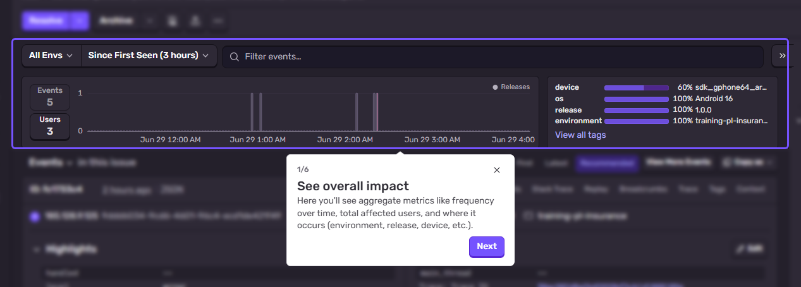
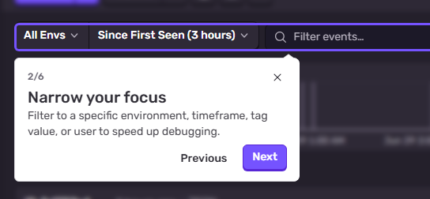
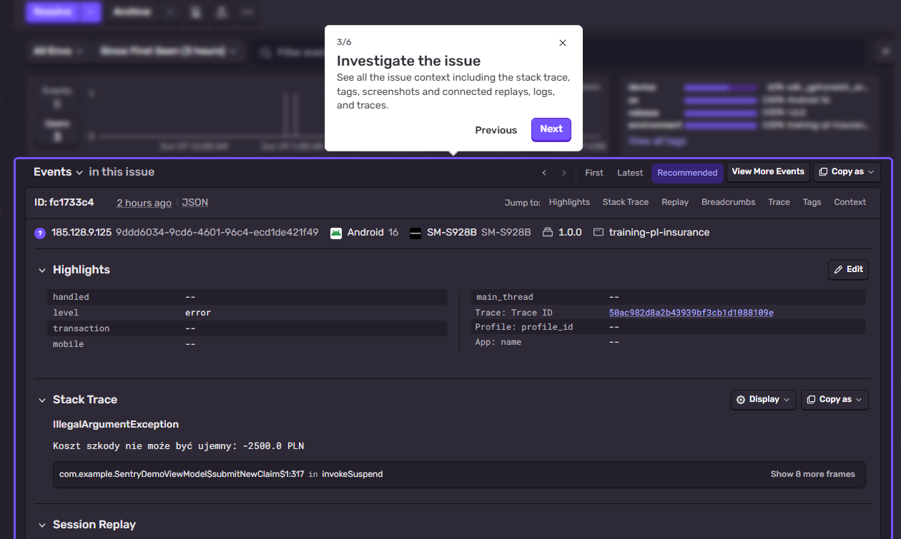
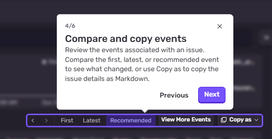
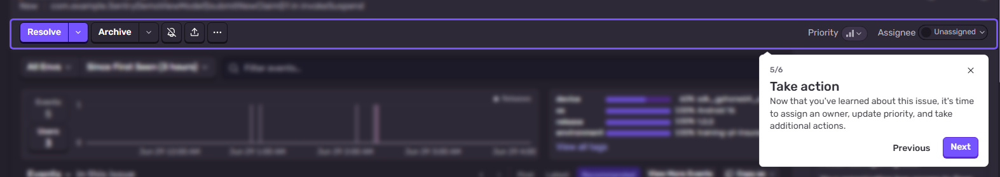
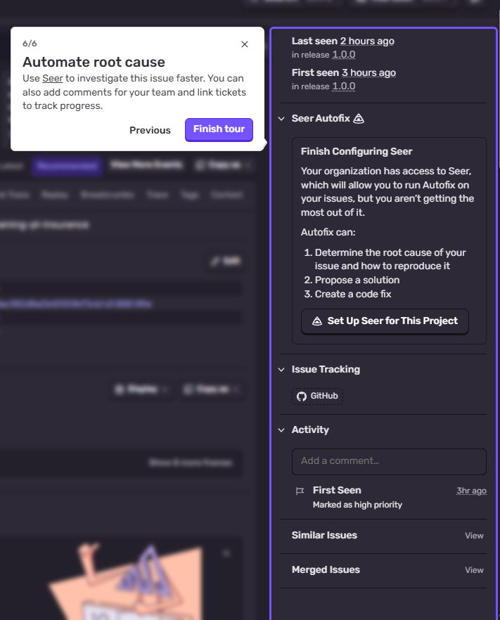

# Sentry Issues — guided tour

## 1. See overall impact

The Issues detail page opens with aggregate metrics showing the scope of an issue. Participants see the event frequency timeline, user impact count, and tag distribution (environment, device OS, release, etc.). This view answers the critical diagnostic question: "How wide is this problem?" A spike in the timeline reveals when the issue started; high user count indicates urgency. The histogram highlights which environments and releases are affected, enabling targeted triage and rollback decisions.

## 2. Narrow your focus

The filter bar allows participants to search and narrow events by environment, timeframe, tag value, or user ID. This step teaches precision debugging: rather than reviewing all 5+ events, filtering to "Android 16 + prod environment + last 2 hours" isolates the problem context. Highlight how quick filters speed up root cause analysis and reduce noise in high-volume issues.

## 3. Investigate the issue

The event detail panel displays the stack trace, breadcrumbs, highlights section (key exception fields), and session replay. Participants see how Sentry unfolds the error narrative: where the code failed, what breadcrumbs led there, and user actions preceding the crash. The stack trace is the primary diagnostic artifact; breadcrumbs and session replay provide behavioral context. Explain that this is where the "why" emerges.

## 4. Compare and copy events

The event navigation toolbar shows First, Latest, and Recommended event selectors. Participants learn to compare events to spot patterns: does the latest repeat the same stack frame, or has it shifted? The "Copy as" menu exports issue details as Markdown for ticket creation or Slack notifications. This step connects Sentry feedback directly to issue tracking workflows.

## 5. Take action

The toolbar features action buttons for issue state management: Resolve (mark fixed), Archive (ignore), Priority level, and Assignee. Participants learn that triage is not passive observation—it is active ownership. Assigning an issue routes responsibility; setting priority communicates urgency to the team. Resolve closes the feedback loop; Archive removes noise from the inbox.

## 6. Automate and integrate

The right sidebar reveals Sentry's intelligence layer: Seer Autofix (AI-driven fix suggestions), first/last seen dates, release association, issue tracking integration (GitHub/Jira), and activity log. Seer can propose code patches; release linking tracks if a deploy resolved the issue. The activity log shows who touched the issue and when, creating an audit trail. This step introduces the intelligent, integrated Sentry workflow beyond manual investigation.

---

## Trainer notes

**Recommended tour sequence (09:20–10:10 fundamentals/triage segment):**

1. **Start with Step 1** — establish the "big picture" mindset. Users must grasp issue scope before diving into details.
2. **Move to Step 2** — teach filtering early so participants can reduce noise and focus on a single cohesive problem flow.
3. **Step 3** — deep dive into a single event's details. Use this to walk the stack trace, breadcrumbs, and session replay together.
4. **Step 4** — show event comparison to teach pattern recognition and the "Copy as" workflow for team communication.
5. **Step 5** — action buttons. Tie assignment and priority to your team's on-call runbook; this is where Sentry becomes operational.
6. **Step 6** — close with intelligence and integration. Mention Seer and release tracking as "force multipliers" for time-constrained on-call engineers.

Total time: ~45 minutes for walkthrough + Q&A.
